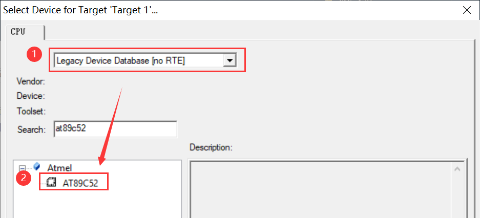
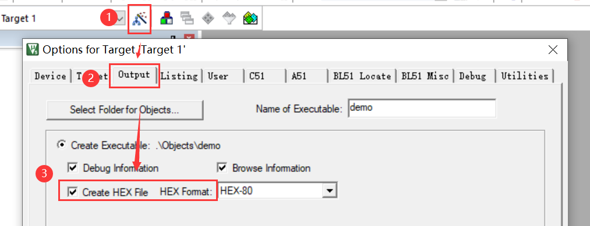
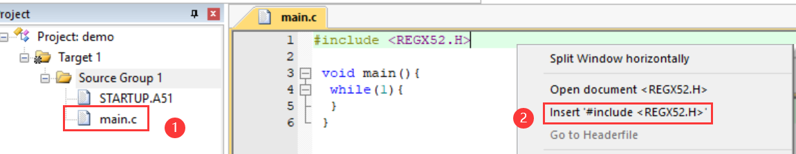
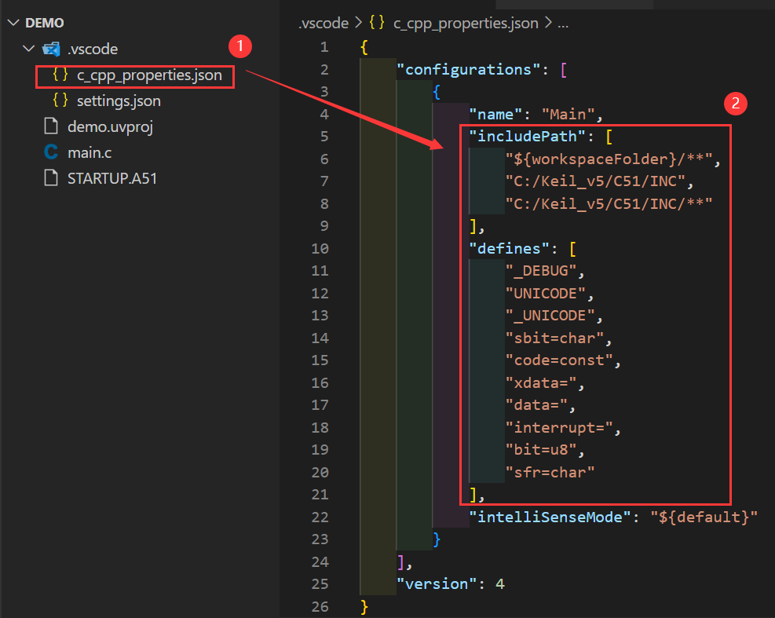
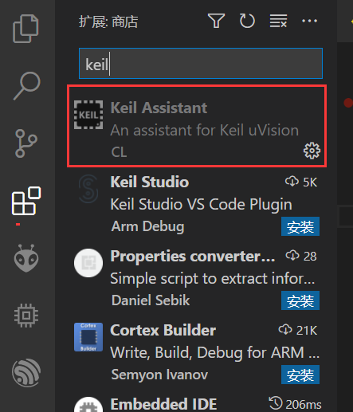

# board-stc89c52rc-samael

4层板，大小仅为 40mm*40mm，非常迷你。

#### 供电：

因STC89C52RC的供电范围是3.6~5.5v（还可以更低电压），所以可以用锂电池直接供电，只不过时钟频率会有所降低。

#### 其他：

* 晶振为 5032 的 11.0592MHz 的贴片晶振

  （3215晶振老不起振才用这个）

* 不带自动下载电路

* 使用了P4口，包括中断

#### 例程

##### 知识点

外部中断、串口、红外、I2C(EEPROM)、定时器

##### 运行现象

* 开始定时器时, LED 会亮灭亮灭闪 (程序默认不开启定时器)

* 串口(baudrate=9600)发送3个字符数据, 控制 RGBLED 的亮灭, eg: 111 -> RGB 全亮, 000 -> RGB 全灭

* 按键: SW1 -> RGBLED 全灭, SW2 -> RGBLED 恢复上次从串口 接受到的状态

* 红外亮灭灯: 具体看 app.c -> ired_handle()

#### 现存问题

* 5v口接含有1uF及以上电容的模块时, 下载程序时ch340会欠压复位, 导致下载失败
* 定时器与红外不共用
  * 因红外使用的是定时器1的中断, 所以定时器1用不了
  * 因定时器0的优先级比红外的高, 导致红外无法正常使用

### VSCode

##### 新建项目(keil)

* 选择芯片 `AT89C52`



* 设置编译时生成HEX文件



* 编写基本代码



##### json 配置(vscode)



```json
"includePath": [
    "${workspaceFolder}/**",
    "C:/Keil_v5/C51/INC",
    "C:/Keil_v5/C51/INC/**"
],
"defines": [
    "_DEBUG",
    "UNICODE",
    "_UNICODE",
	"sbit=char",
	"code=const",
	"xdata=",
	"data=",
	"interrupt=",
	"bit=u8",
    "sfr=char"
]
```

注：勿启用 Keil Assistant 插件，该插件会去除自己配置的 includePath，导致找不到头文件

